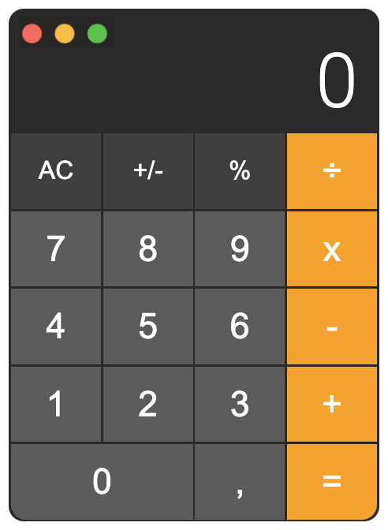

# Calculator

#### Application to simulate a mac os calculator in order to improve frontend skills, it has been developed only with js, html and css. You can try the app here [macos calculator](https://alherdom.github.io/macos_calculator/).

